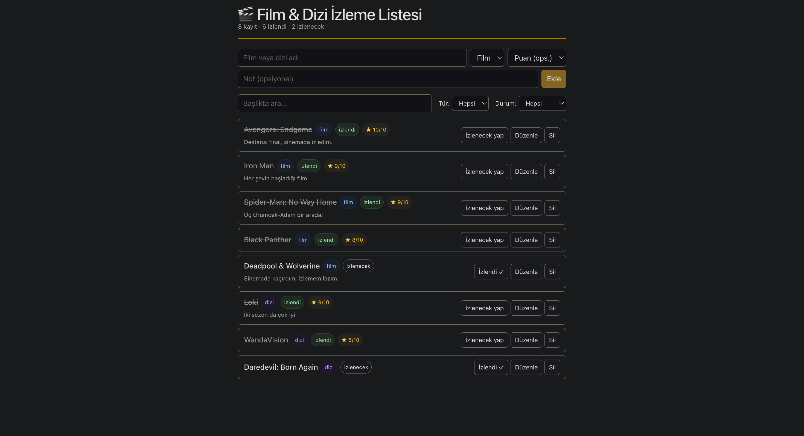

# 🎬 Film & Dizi İzleme Listesi

İzlemek istediğim ve izlediğim film/dizileri tek yerden yönettiğim bir web
uygulaması. React öğrenimi kapsamında geliştirdiğim eğitim bitirme projesidir.

> Veriler tarayıcının **LocalStorage**'ında saklanır; herhangi bir sunucu veya
> veritabanı gerektirmez.

## 📸 Ekran Görüntüsü
  

## ✨ Özellikler

**Zorunlu işlemler (CRUD):**

| İşlem | Açıklama |
|-------|----------|
| ➕ Ekle | Başlık, tür (film/dizi), opsiyonel puan (1–10) ve not ile kayıt ekleme |
| 📋 Listele | Tüm kayıtları kart görünümünde listeleme |
| ✏️ Güncelle | Kaydı düzenleme + tek tıkla izlendi/izlenecek durumu değiştirme |
| 🗑️ Sil | Onay sorusuyla güvenli silme |

**Ek özellikler:**

- 💾 LocalStorage ile kalıcılık — sayfa yenilenince veriler kaybolmaz
- 🔍 Türkçe karakter uyumlu başlık araması (İ/ı duyarlı)
- 🎯 Tür ve duruma göre filtreleme
- ⭐ Puanlama (1–10) ve serbest not alanı
- 📊 İstatistik satırı (toplam / izlendi / izlenecek)
- 🌗 Sistem temasına uyumlu açık/koyu görünüm

## 🛠️ Kullanılan Teknolojiler

- [Vite](https://vite.dev/) — hızlı geliştirme ve derleme aracı
- [React 19](https://react.dev/) (JavaScript)
- Pure CSS — hiçbir CSS framework'ü kullanılmadı
- LocalStorage — istemci taraflı veri saklama

## 🚀 Kurulum ve Çalıştırma

```bash
# 1. Bağımlılıkları yükle
npm install

# 2. Geliştirme sunucusunu başlat (http://localhost:5173)
npm run dev

# 3. Üretim derlemesi al (dist/ klasörüne)
npm run build
```

## 📁 Proje Yapısı

```
src/
├── App.jsx              # Veri katmanı: movies state, LocalStorage, CRUD işlemleri
├── pages/
│   └── Home.jsx         # Sayfa düzeni; arama, filtre ve düzenleme durumu
└── components/
    ├── MovieForm.jsx    # Ekleme ve düzenleme formu
    ├── FilterBar.jsx    # Arama kutusu + tür/durum filtreleri
    ├── MovieList.jsx    # Liste ve boş durum mesajı
    └── MovieItem.jsx    # Tek kayıt satırı ve işlem butonları
```

## 🗃️ Veri Modeli

Her kayıt LocalStorage'da şu yapıda tutulur:

```js
{
  id,                              // benzersiz kimlik (crypto.randomUUID)
  title,                           // başlık
  type: "film" | "dizi",           // tür
  status: "izlenecek" | "izlendi", // durum
  rating: 1-10 | null,             // puan (opsiyonel)
  note: string                     // not (opsiyonel)
}
```
